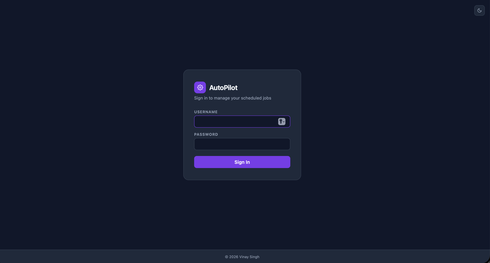
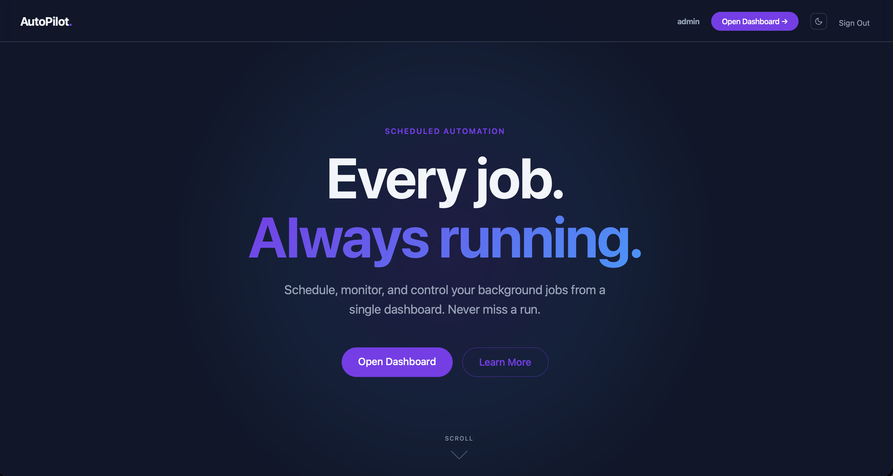
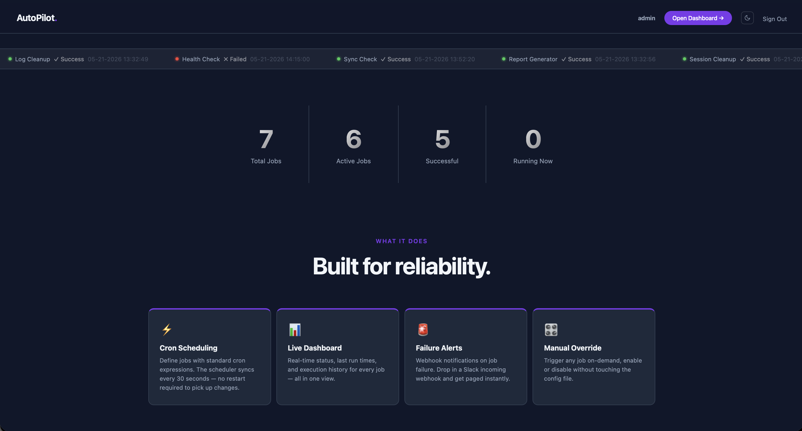
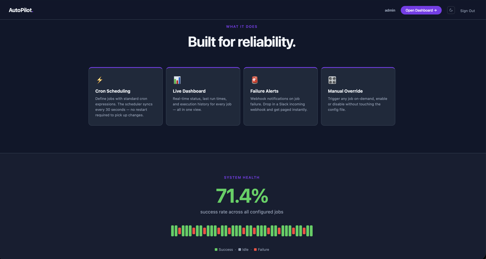
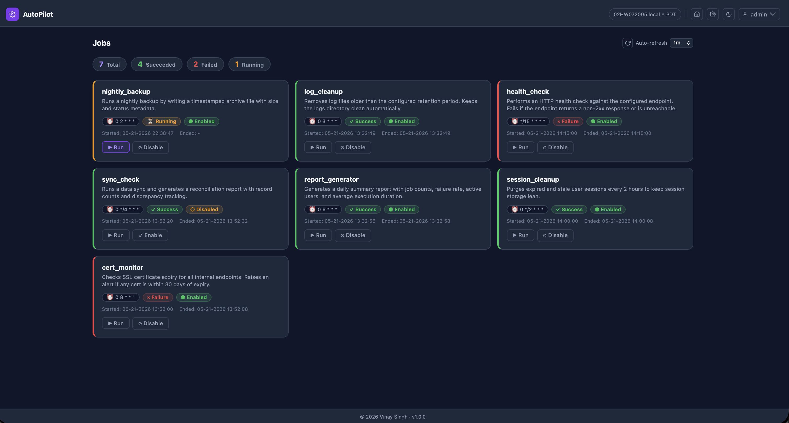
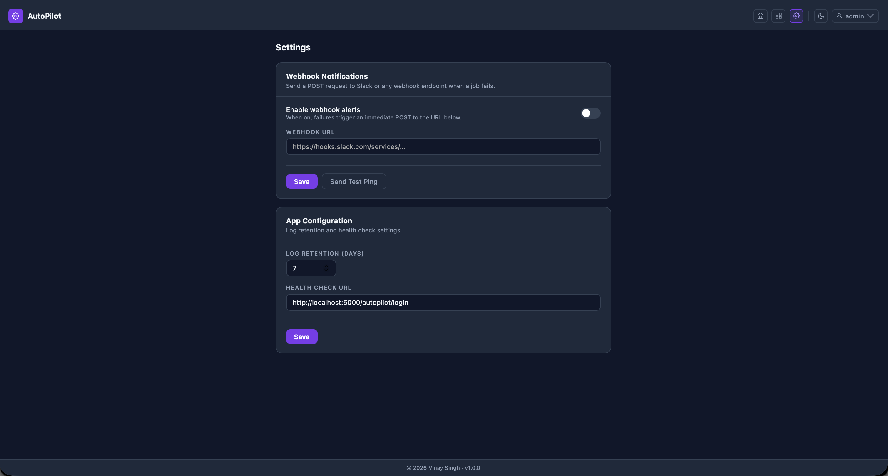

# AutoPilot 🚀

[](https://github.com/vinay-singh-engineer/autopilot/blob/main/LICENSE)
[](https://github.com/vinay-singh-engineer/autopilot/actions/workflows/ci.yml)

A lightweight, self-hosted job scheduler with a real-time web dashboard. Schedule Python scripts, monitor execution status, enable/disable jobs on the fly, and get notified on failures — all through a clean browser UI.

---

## Preview

| Login | Landing Page |
|:------|:-------------|
|  |  |

| Landing Page.. | Landing Page... |
|:--------------------|:------------------------|
|  |  |

| Dashboard | Settings |
|:----------|:---------|
|  |  |

---

## What It Does

AutoPilot lets you schedule and manage recurring background jobs from a web dashboard. Jobs are defined in a JSON config file and executed on a cron schedule. The dashboard shows live status (running, success, failure), last run times, and lets you trigger any job manually with a single click.

This project is a sanitized public version of a production job scheduler I built and operated for a large-scale internal platform. The original ran 13 scheduled jobs across two datacenters, handling tasks like health checks, user session cleanup, log rotation, and data synchronization.

---

## Tech Stack

| Layer         | Technology               | Purpose                                      |
|:--------------|:-------------------------|:---------------------------------------------|
| Web           | Flask 3.x                | HTTP server, routing, template rendering     |
| Scheduler     | APScheduler 3.x          | Background cron scheduler                    |
| Auth          | Flask sessions           | Session-based login with env-var credentials |
| Templating    | Jinja2 (via Flask)       | Server-rendered HTML dashboard               |
| Jobs          | Python subprocess        | Executes job scripts as child processes      |
| Notifications | Webhook (configurable)   | POST to Slack or any webhook on job failure  |
| Config        | JSON files               | Job definitions and runtime status           |
| Testing       | pytest + pytest-cov      | Unit tests with coverage reporting           |
| Linting       | flake8                   | Code style enforcement                       |
| CI            | GitHub Actions           | Lint + test on push to `main` / `development`|

---

## Architecture

```
Browser
   │
   ▼
Flask (server.py)          ← handles HTTP routes, auth, config reads/writes
   │         │
   │         └── templates/       ← Jinja2: login, landing, dashboard, logout
   │
   ├── Threading
   │      │
   │      └── scheduler.py        ← APScheduler, reads jobs.json every 30s
   │               │
   │               └── runner.py  ← executes job scripts via subprocess
   │                       │
   │                       ├── jobs/nightly_backup.py
   │                       ├── jobs/log_cleanup.py
   │                       ├── jobs/health_check.py
   │                       ├── jobs/sync_check.py
   │                       ├── jobs/report_generator.py
   │                       ├── jobs/session_cleanup.py
   │                       └── jobs/cert_monitor.py
   │
   ├── config/jobs.json            ← job definitions (path, cron, enabled flag)
   ├── config/status.json          ← live job status (mutex-protected writes)
   └── config/settings.json        ← app settings (log retention, webhook URL)
```

---

## Request Flow

```
1. User visits /autopilot/login
2. Submits credentials → validated against .env vars
3. Flask sets session cookie → redirects to /autopilot (landing page)
4. User clicks "Open Dashboard" → /autopilot/main
5. server.py reads jobs.json + status.json → renders dashboard
6. User clicks "Run" → POST /autopilot/main/run/<job>
7. Flask spawns a thread → runner.py executes the job script
8. runner.py updates status.json (thread-safe, mutex lock)
9. Dashboard auto-refreshes → shows updated status
```

---

## Routes

| Method | Endpoint                          | Auth | Description                              |
|:-------|:----------------------------------|:-----|:-----------------------------------------|
| GET    | `/autopilot/login`                | —    | Sign-in page                             |
| POST   | `/autopilot/login`                | —    | Authenticate and set session cookie      |
| GET    | `/autopilot`                      | ✓    | Landing page with live stats and ticker  |
| GET    | `/autopilot/main`                 | ✓    | Job dashboard                            |
| POST   | `/autopilot/main/run/<job>`       | ✓    | Trigger a job manually                   |
| POST   | `/autopilot/main/toggle/<job>`    | ✓    | Enable or disable a job                  |
| GET    | `/autopilot/settings`             | ✓    | Settings page                            |
| POST   | `/autopilot/settings`             | ✓    | Save webhook, log retention, health check URL |
| POST   | `/autopilot/settings/test`        | ✓    | Fire a test webhook ping (returns JSON)  |
| POST   | `/autopilot/logout`               | ✓    | Clear session and sign out               |

---

## Job Execution Flow

```
APScheduler (background thread)
   │
   ├── Every 30s: reads jobs.json
   ├── Schedules new enabled jobs, removes disabled ones
   └── On cron tick: calls runner.run_job(job_name, script_path)
                              │
                              ├── Marks status = "Running" in status.json
                              ├── subprocess.run(["python3", script_path])
                              ├── Marks status = "Success" or "Failure"
                              └── If Failure: calls notifier.notify() → webhook POST
```

---

## Project Structure

```
autopilot/
├── app/
│   ├── server.py             # Flask app — routes, auth, session management
│   ├── scheduler.py          # APScheduler — job scheduling and cron sync
│   ├── runner.py             # Job executor — subprocess + status tracking
│   ├── notifier.py           # Webhook notifier on job failure
│   ├── VERSION               # App version displayed in the footer
│   ├── requirements.txt
│   ├── config/
│   │   ├── jobs.json         # Job definitions
│   │   ├── status.json       # Live execution status (written at runtime)
│   │   └── settings.json     # App config (log retention, webhook, health check URL)
│   ├── jobs/
│   │   ├── nightly_backup.py    # Runs a nightly backup with a timestamped archive file
│   │   ├── log_cleanup.py    # Removes log files past retention period
│   │   ├── health_check.py   # HTTP health check against a configured endpoint
│   │   ├── sync_check.py     # Runs a data sync with reconciliation report
│   │   ├── report_generator.py  # Generates a daily summary report
│   │   ├── session_cleanup.py   # Purges expired and stale user sessions
│   │   └── cert_monitor.py      # Checks SSL certificate expiry for internal endpoints
│   ├── templates/
│   │   ├── login.html        # Sign-in page
│   │   ├── index.html        # Landing page with live ticker and stats
│   │   ├── main.html         # Job dashboard (stats, cards, actions)
│   │   ├── settings.html     # Settings page (webhook, log retention, health check URL)
│   │   ├── logout.html       # Sign-out confirmation
│   │   └── 401.html          # Unauthorized error page
│   └── tests/
│       └── test_server.py    # 18 tests covering auth, routing, toggle, run, stats, settings
├── .env.example
├── .flake8
├── .gitignore
├── VERSION
└── .github/
    └── workflows/
        └── ci.yml
```

---

## Jobs

| Job                  | Schedule         | Enabled | Description                                         |
|:---------------------|:-----------------|:--------|:----------------------------------------------------|
| `nightly_backup`     | `0 2 * * *`      | ✓       | Runs a nightly backup with a timestamped archive file  |
| `log_cleanup`        | `0 3 * * *`      | ✓       | Removes log files past the configured retention     |
| `health_check`       | `*/15 * * * *`   | ✓       | HTTP health check against the configured endpoint   |
| `sync_check`         | `0 */4 * * *`    | —       | Runs a data sync and generates a reconciliation report  |
| `report_generator`   | `0 6 * * *`      | ✓       | Generates a daily summary report                    |
| `session_cleanup`    | `0 */2 * * *`    | ✓       | Purges expired and stale user sessions              |
| `cert_monitor`       | `0 8 * * 1`      | ✓       | Checks SSL certificate expiry for internal hosts    |

---

## How to Run Locally

### Prerequisites

- Python 3.9+
- pip

### Setup

```bash
# Clone the repo
git clone https://github.com/vinay-singh-engineer/autopilot.git
cd autopilot

# Create your environment file
cp .env.example .env
# Edit .env to set your username and password (optional — defaults: admin / changeme)

# Install dependencies
pip install -r app/requirements.txt

# Run the app
cd app
python3 server.py
```

Open `http://localhost:5000/autopilot/login` in your browser.

Default credentials (from `.env.example`):
- Username: `admin`
- Password: `changeme`

### Run Tests

```bash
cd app
PYTHONPATH=. pytest tests/ -v
```

---

## Configuration

### `.env`

| Variable               | Description                     | Default                  |
|:-----------------------|:--------------------------------|:-------------------------|
| `AUTOPILOT_USERNAME`   | Dashboard login username        | `admin`                  |
| `AUTOPILOT_PASSWORD`   | Dashboard login password        | `changeme`               |
| `AUTOPILOT_SECRET_KEY` | Flask session secret key        | `dev-secret-change-...`  |

### `config/jobs.json`

Defines all scheduled jobs. The scheduler reads this file every 30 seconds, so changes take effect without a restart.

```json
{
  "my_job": {
    "path": "jobs/my_script.py",
    "enabled": true,
    "cron": "0 2 * * *",
    "info": "Description shown on hover in the dashboard."
  }
}
```

### `config/settings.json`

```json
{
  "app": {
    "logRetention": 7
  },
  "webhook": {
    "enabled": false,
    "url": ""
  },
  "healthCheck": {
    "url": "http://localhost:5000/autopilot/login"
  }
}
```

Set `webhook.enabled: true` and provide a Slack incoming webhook URL to get notified on job failures.

---

## CI

GitHub Actions runs on every push to `main` or `development` and on pull requests targeting `main`.

| Job       | What it does                                              |
|:----------|:----------------------------------------------------------|
| Lint      | `flake8` — enforces style (max line length 110)           |
| Test      | `pytest` on Python 3.11 and 3.12 with coverage reporting  |
| Coverage  | Uploaded to Codecov (3.12 run only)                       |

---

## Key Design Decisions

**Session-based auth instead of OAuth2**
The original production version used corporate OIDC with LDAP group authorization. For a public portfolio project with a single operator, session-based auth with credentials in `.env` is the right tradeoff — simpler, zero external dependencies, and easy to understand.

**No Docker**
AutoPilot is an ops tool designed to run on a server alongside the services it monitors. Containerizing it would mean the job scripts can no longer access the host filesystem, logs, or processes they need to interact with. Running directly on the host (`python3 server.py`) is the correct deployment model for this class of tool.

**Not deployed to a public URL**
Job schedulers are internal infrastructure, not user-facing services. Deploying this to AWS App Runner or Fly.io would mean running a permanent process for a tool that demonstrates a pattern, not a product. The code quality, architecture, and test coverage tell the story — a hiring engineer can clone and run it in under two minutes.

**JSON config instead of a database**
Job definitions and status are stored in plain JSON files. This keeps the project dependency-free (no Postgres, no Redis), makes config changes reviewable in git, and is sufficient for the scale this tool targets. Thread-safe writes use a `threading.Lock()` to prevent race conditions when multiple jobs finish simultaneously.

**Scheduler syncs every 30 seconds**
Rather than requiring a restart to pick up config changes, the scheduler polls `jobs.json` every 30 seconds. This means you can enable/disable jobs or change cron expressions from the dashboard and they take effect automatically — the same behavior as the production system.

**Generic Python jobs instead of shell scripts**
The original used ksh scripts specific to an internal platform. Replacing them with Python scripts makes the jobs portable, testable, and immediately runnable on any system with Python. Each job is a standalone script with a `run()` function that can be executed directly for debugging.

---

## License

MIT — use freely, attribute appreciated.

---

## 💻 Author

[Vinay Singh](https://vinay-singh-engineer.github.io/portfolio)

---